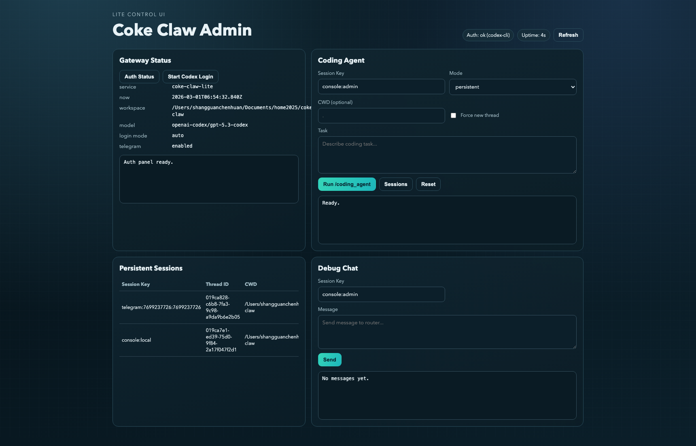

# Coke Claw Lite

基于 OpenClaw 思路做的精简版实现，目标是保留最核心链路：

- Telegram 单渠道
- Codex 登录复用（`openai-codex`）+ OpenAI API Key（`openai`）
- `/coding_agent` 调用 codex CLI
- Mac 文件/浏览器工具
- 精简控制台
- 精简管理端（Admin UI）

## 管理端预览



## 功能范围

1. Telegram 消息收发（含 slash command）
2. 模型调用：`openai` / `openai-codex`
3. 认证方式：
   - `MODEL_REF=openai-codex/...`：复用 Codex 登录态（`codex login`）
   - `MODEL_REF=openai/...`：使用 `OPENAI_API_KEY`
4. Slash 命令：
   - `/help`
   - `/auth status`
   - `/auth login`
   - `/coding_agent ...`
5. 管理端 API + Web UI：
   - 健康状态
   - Auth 状态与设备码登录
   - coding_agent 运行/重置/会话列表
   - 调试聊天

## 快速开始

### 1. 安装依赖

```bash
npm install
```

### 2. 配置环境变量

```bash
cp .env.example .env
```

最少要配置（Telegram）：

```env
TELEGRAM_BOT_TOKEN=你的telegram机器人token
WORKSPACE_ROOT=/Users/xxx/your-path/coke-claw
```

可选配置：

```env
MODEL_REF=openai-codex/gpt-5.3-codex
CODEX_LOGIN_MODE=auto
ADMIN_HOST=127.0.0.1
ADMIN_PORT=3187
```

### 3. 启动服务

只开管理端：

```bash
npm run dev:admin
```

Telegram + 管理端：

```bash
npm run dev:telegram-admin
```

全开（Telegram + Console + Admin）：

```bash
npm run dev:all
```

## 使用说明

### Telegram 端

1. 在 Telegram 打开你的 bot（例如 `@coke_claw_bot`）
2. 发送 `/start`、`/help`
3. 检查登录状态：`/auth status`
4. 如果未登录：`/auth login`，按返回 URL + code 去 OpenAI 完成登录
5. 执行 coding 任务：

```text
/coding_agent 请在 tetris-demo 目录创建一个原生 JS 的俄罗斯方块网页游戏
```

会话相关命令：

```text
/coding_agent sessions
/coding_agent reset
```

### 管理端

打开：`http://127.0.0.1:3187`

可以直接：

1. 点 `Auth Status` 查看当前是否复用到 Codex 登录
2. 点 `Start Codex Login` 获取设备码登录信息
3. 在 `Coding Agent` 面板执行任务
4. 在 `Persistent Sessions` 查看会话绑定

## 测试

单元/集成测试：

```bash
npm test
```

端到端测试（admin api + telegram + admin ui）：

```bash
npm run test:e2e
```

仅 UI e2e：

```bash
npm run test:e2e:ui
```

## 主要命令

```bash
npm run dev:telegram
npm run dev:console
npm run dev:admin
npm run dev:telegram-admin
npm run dev:all
npm run codex:login
```

## 项目结构

```text
src/lite/
  app.ts
  config.ts
  auth/
  channels/telegram/
  runtime/
  tools/
  admin/
  acp/
  console/
src/tests/
src/e2e/
docs/
```

## 注意事项

1. `.env` 已在 `.gitignore` 中，不会被提交。
2. `codex login --device-auth` 登录后，服务会自动优先复用 Codex 凭证。
3. 如果 Telegram token 泄露，请立即在 `@BotFather` 执行 `/revoke`。
